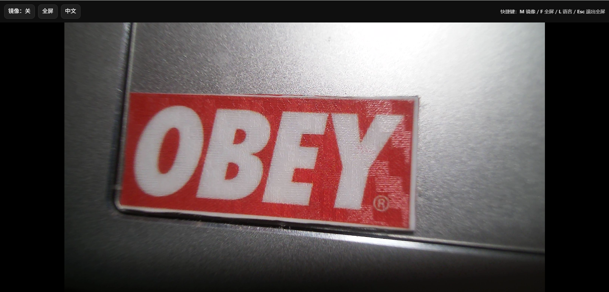

# WebMirror

WebMirror 是一个轻量的浏览器摄像头镜像页面。

## 效果预览

## 功能

- 浏览器内实时摄像头预览
- 镜像开关
- 全屏模式
- 中英文界面切换
- 默认根据系统/浏览器语言显示中文或英文，并记住手动切换结果

## 使用方式

1. 用 Edge 或 Chrome 等现代浏览器打开 [WebMirror.html](./WebMirror.html)。
2. 在浏览器提示时允许访问摄像头。
3. 通过顶部按钮切换镜像、进入全屏或切换界面语言。
4. 语言按钮显示当前界面语言：英文界面显示 `EN`，中文界面显示 `中文`。

## 快捷键

- `M`：切换镜像
- `F`：切换全屏
- `L`：切换语言
- `Esc`：退出全屏

## 说明

- 当前页面会直接打开默认摄像头。
- 某些浏览器会因为权限策略限制非默认摄像头或设备名称的返回结果。

## English README

- 见 [README.md](./README.md)
